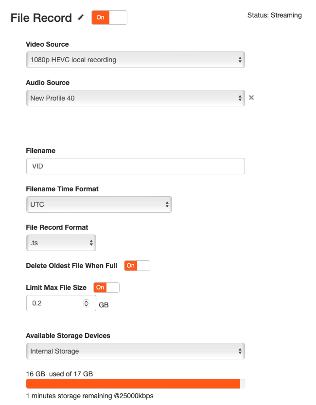

# JSON server/parser for live-to-VOD

This is an example of a Docker container, running on a LiveEdge Node that receives JSON commands to perform a Live-to-VOD .ts file creation, with given start and stop times.

Once this Docker container is running, it opens up a TCP server on port `9999` (this can be changed in `app.py`) and expects a JSON command sent as HTTP POST with a body like:

```
 {
  "events": [
   {
     "id": "event_id_for_this",
     "time": "2023-07-15T20:38:51",
     "other_data": "foobar",
     "eventClips": [
       {
         "id": "goal-9a98-fc9a0cf61251",
         "tCin": "2023-11-09 23:50:15.170",
         "tCout": "2023-11-09 23:50:25.671",
         "title": "Goal by Zidane",
         "metadata": "Description of this fantastic action"
       }
     ]
   }
  ]
 }
```

This will generate a file "goal-9a98-fc9a0cf61251.ts" starting from 23:50:15 and ending at 23:50:25.

# Setting up local recording on the LiveEdge device

You need to have an audio and a video encoders set up in your LiveEdge device, and a "File Record" output that will record local `.ts` video files continuously.

Set up the UTC or local timezone accordingly to the JSON requests.

Make sure you enable "Delete Oldest Files When Full" to make it a circular buffer of files processed on the LiveEdge device.

A typical setup would be the following:



# Running the Example Docker Container

To run this example on your local device, you'll first need to [set up your development environment](https://support.videonlabs.com/hc/en-us/articles/4403731257491-Getting-Started-with-the-LiveEdge-Compute-Toolkit) and be able to access the device shell through `adb`:

```
[Local Machine]: adb connect <device ip>
[Local Machine]: adb root
[Local Machine]: adb shell
```

Once logged into the device's shell, you must set up the local environment with the `source` command:

```
[LiveEdge Compute Shell]: source /data/local/vstream/etc/env.sh
```

Create a working directory in `/data/local/`:

```
[LiveEdge Compute Shell]: mkdir /data/local/JSONServer
```

Clone this repository to a directory on your local machine, then use `adb` to copy the files to the working directory you created on the device:

```
[Local Machine]: adb push . /data/local/JSONServer
```

Run the `docker build` command in the working directory:

```
[LiveEdge Compute Shell]: docker build -t recorder_json .
```

Upon a successful build, run the container in the background to see it in action:

```
[LiveEdge Compute Shell]: docker run --name=recorder_json -v /data/local/internal_storage/savedvideo/Media/:/recordings -p9999:9999 recorder_json &
```

The previous command gives the Docker container access to two resources on the host:
 * port `9999` to list to the HTTP commands with the JSON body
 * file recordings from the LiveEdge device (stored locally in `/data/local/internal_storage/savedvideo/Media/`, and accessed in Docker through `/recordings`).

# Running an example test

A sample command could be:

```
curl -X POST -d '{ "events": [ { "id": "test_event", "eventClips" : [ { "id" : "test_file_123", "tCin": "2023-11-09 23:50:15.170", "tCout": "2023-11-09 23:50:25.671" } ] } ] }' http://<your_liveedge_node>:9999
```

After issuing this command, the resulting file `test_file_123.ts` will be available with the other saved media files on the LiveEdge device.


